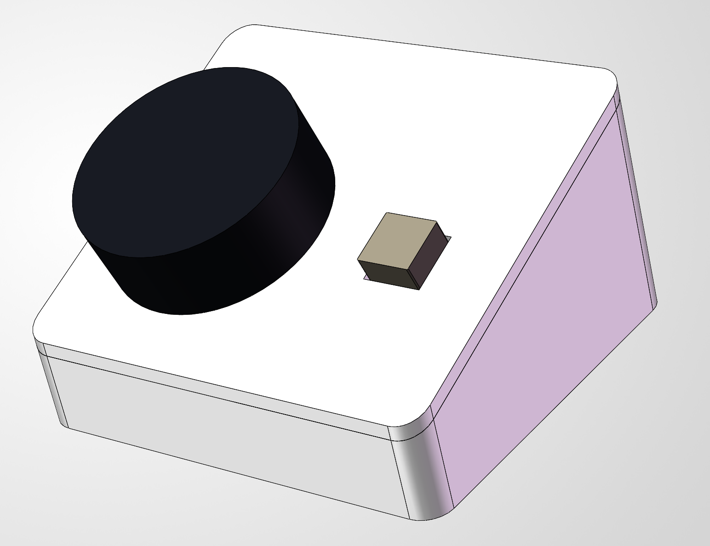

# media-controller



一台 USB 媒体旋钮控制台：Type-C 接电脑，转旋钮调音量或切歌，按旋钮播放/暂停，长按静音，LED 自锁开关切换音量与切歌两种模式。电脑把它识别为标准 HID Consumer Control 设备，不需要安装专用驱动。

仓库包含这台设备完整的三部分设计，不只是固件。电气部分由三个现成模块组成，载板只做互连和 3V3/GND 分配，不重新设计电路；两个控件的固定、露出量和按压支撑全部交给外壳结构，载板上不布置它们的安装孔。

| 部分 | 位置 | 工具与格式 | 当前状态 |
| --- | --- | --- | --- |
| 固件 | `src/`、`include/`、`CMakeLists.txt` | C++17，Pico SDK 2.3.1 + TinyUSB | 已在整机上验证交互 |
| 载板 PCB | [hardware/pcb](hardware/pcb/README.md) | 嘉立创 EDA 专业版 `.eprj3` 工程 | v1.1 已下单并组装完成 |
| 外壳 | [hardware/enclosure](hardware/enclosure/README.md) | SOLIDWORKS 2026，导出 STL | 样件版次，待打印试装 |

三个模块是 **Waveshare RP2350-Zero** 主控、**Waveshare Rotation Sensor**（EC11 编码器带按键）和 **YFROBOT LED 自锁开关**，均为已购成品，实物资料在 [hardware/pcb/reference](hardware/pcb/reference/)。主控在调试阶段用带排针的 `-M` 版本，最终装配用无预焊排针版本，自行焊排针后插入载板排母。

## 仓库目录

```text
media-controller/
├─ README.md                 本文件：项目总览与固件说明
├─ CMakeLists.txt            板级定义 waveshare_rp2350_zero；产物 build/media-controller.uf2
├─ pico_sdk_import.cmake     pico-sdk 官方导入脚本
├─ src/                      固件实现，按分层分子目录
│  ├─ main.cpp               入口，只创建应用对象并启动
│  ├─ app/                   板级接线、运行状态与产品行为映射
│  ├─ device/                两个模块的引脚、电平、上下拉与采样节奏
│  ├─ input/                 去抖、格雷码与手势解码，不依赖 Pico SDK
│  └─ usb/                   TinyUSB 描述符、动作队列与报告发送
├─ include/                  头文件，子目录与 src/ 一一对应
├─ docs/
│  └─ ref/                   整机、载板与内部结构的参考渲染图
└─ hardware/
   ├─ pcb/                   载板：制板工程与设计记录
   │  ├─ kiro-media-controller-carrier-v1.1/   原理图、PCB 与拼板源工程
   │  ├─ reference/          三个已购模块的实物资料：主控尺寸图、按钮与编码器照片
   │  ├─ README.md           设计范围、连接方式与三个模块的实测尺寸
   │  ├─ ASSEMBLY.md         连接件规格、焊接步骤与接口方向
   │  └─ TUTORIAL.md         从新建工程到一键下单的分步教程
   └─ enclosure/             外壳：结构模型与打印文件
      ├─ cad/                Music_Controller.SLDASM 整机入口、4 个打印件、6 个 REF_ 参考件
      ├─ print/              4 个打印件的 STL
      ├─ docs/               装配与打印说明、STEP 导入、检查记录与三张剖面图
      └─ README.md           当前版次的结构改动与检查结果
```

`build/` 和 `.vscode/` 不纳入版本管理。硬件两个目录的说明各有侧重：PCB 侧记录实测尺寸、连接件选型和下单流程，外壳侧记录当前版次改了什么、检查到什么程度。SOLIDWORKS 整机入口是 `hardware/enclosure/cad/Music_Controller.SLDASM`，`cad` 里的 `REF_` 零件是器件参考模型，不打印，搬动装配体时要连整个 `cad` 目录一起带走。

下文说明固件的行为、接线、结构和构建刷写。

## 使用方式

模式开关使用 YFROBOT LED **自锁版**：每按一次切换开/关，松手后保持状态。

| LED 自锁开关 | 顺时针旋转 | 逆时针旋转 | 短按旋钮 | 长按旋钮 |
| --- | --- | --- | --- | --- |
| 熄灭：音量模式 | 音量加 | 音量减 | 播放/暂停 | 静音切换 |
| 点亮：切歌模式 | 下一首 | 上一首 | 播放/暂停 | 静音切换 |

旋转方向、模式切换、按键动作和切歌冷却机制已在整机上验证。当前冷却时间延长至 500 ms，时长的实际手感还需上板确认。LED 自锁开关单独通电时，测得灯灭时 `SIG` 对 `GND` 稳定约为 0 V、灯亮时约为 3.3 V，与固件设定的高电平有效极性一致。

在目前使用的 Windows 电脑上，一次音量动作会让系统显示值变化 2；电脑自带的独立音量键也是相同步长。这是主机侧的音量刻度，不能据此判断固件发送了两次动作。

短按在去抖后的松开时识别；长按在去抖后的按下状态持续 700 ms 后识别。手势解码器支持双击，但当前关闭该功能，250 ms 双击窗口不参与判断，也没有绑定媒体动作。

当主机挂起 USB 且允许远程唤醒时，新输入会尝试唤醒主机；成功入队的动作在总线恢复后继续发送。能否唤醒整机睡眠取决于主机配置，不能保证所有睡眠状态都可唤醒。

## 接线

两个模块都接开发板的 **3V3**，并与开发板共地；本项目不从 `5V` 或 `VBUS` 给模块供电。[RP2350 数据手册](https://datasheets.raspberrypi.com/rp2350/rp2350-datasheet.pdf)指出，使用的 GP2～GP5 属于容忍较高输入电压的 FT GPIO，且仅在 IOVDD 已供 3.3V 时才能容忍最高 5.5V 输入。统一使用 3.3V 供电可避免依赖这一条件及不同电源的上电顺序。

| 模块 | 信号 | RP2350-Zero-M |
| --- | --- | --- |
| LED 自锁开关 | `SIG` | `GP2` |
| EC11 Rotation Sensor | `SIA`（A 相） | `GP3` |
| EC11 Rotation Sensor | `SIB`（B 相） | `GP4` |
| EC11 Rotation Sensor | `SW`（内置按键） | `GP5` |
| 两个模块 | `VCC`、`GND` | `3V3`、`GND` |

LED 自锁开关的 `NC` 不接。EC11 模块的 A/B/SW 信号由模块板上拉高，固件不启用 MCU 内部上下拉。模式开关的 `SIG` 也不启用内部上下拉；单独供电实测灯灭时 `SIG` 对 `GND` 稳定约为 0 V，灯亮时约为 3.3 V。

开发板的排针丝印是裸数字，例如丝印 `3` 对应代码中的 `GP3`。接线时请以板上丝印和 [Waveshare RP2350-Zero 官方资料](https://www.waveshare.com/wiki/RP2350-Zero)中的引脚图为准，尤其要区分 `5V`、`GND` 与 `3V3`。

## 代码怎样运行

```text
main.cpp
  └─ MediaControllerApp::run()：初始化并持续轮询
       ├─ YfrobotLedLatchingSwitch / WaveshareRotationSensor：配置 GPIO、读取模块、控制采样节奏
       │    └─ DebouncedSwitch / ButtonGestureDecoder / QuadratureDecoder：只处理采样值
       ├─ 把模式、旋转格数和按键手势映射为媒体动作
       └─ media_hid：把动作排队，经 TinyUSB 发送 HID 报告
```

`main.cpp` 只创建应用对象并启动它。板上引脚编号和“旋转代表音量还是切歌”的规则集中在应用模块。器件类持有引脚，知道模块的高低电平、上下拉和采样节奏，向应用返回稳定状态、手势或机械卡点数。纯输入处理类接收采样值，按需要使用时间戳，不依赖 Pico SDK。`media_hid` 管理 USB 描述符、动作队列以及一次媒体按键的“按下 → 松开”报告。

| 位置 | 职责 |
| --- | --- |
| [src/main.cpp](src/main.cpp) | 固件入口 |
| [include/app/media_controller_app.h](include/app/media_controller_app.h) | 应用接口、运行状态以及板级接线和交互时序常量 |
| [src/app/media_controller_app.cpp](src/app/media_controller_app.cpp) | 初始化、主循环与产品行为映射 |
| [src/device/waveshare_rotation_sensor.cpp](src/device/waveshare_rotation_sensor.cpp) | 配置并读取 Waveshare 旋钮模块的 A/B/SW，A/B 两次采样至少间隔 1 ms |
| [src/device/yfrobot_led_latching_switch.cpp](src/device/yfrobot_led_latching_switch.cpp) | 配置并读取 YFROBOT LED 自锁开关的 SIG |
| [src/input/quadrature_decoder.cpp](src/input/quadrature_decoder.cpp) | 把两位 A/B 相位变化转换为带符号的机械卡点数 |
| [src/input/debounced_switch.cpp](src/input/debounced_switch.cpp) | 将原始有效/无效采样去抖，供模式开关和旋钮按键复用 |
| [src/input/button_gesture_decoder.cpp](src/input/button_gesture_decoder.cpp) | 从去抖后的按下/松开状态识别短按、长按、双击 |
| [include/input/button_gesture.h](include/input/button_gesture.h) | 器件、解码器和应用共用的手势事件与时间配置 |
| [src/usb/media_hid.cpp](src/usb/media_hid.cpp) | TinyUSB 描述符、HID 媒体报告与发送队列 |
| [include/usb/tusb_config.h](include/usb/tusb_config.h) | TinyUSB 编译配置；CMake 将此目录加入头文件搜索路径 |

这里没有额外包装 GPIO、SPI、USB 的通用“物理层”；底层访问直接使用 Pico SDK 和 TinyUSB。以后接屏幕时，屏幕驱动负责面板命令和总线传输；只有像素转换或渲染逻辑变复杂时，才需要单独提取不依赖硬件的编码组件。

设备自身的采样间隔、去抖时长和每格跳变数放在对应类的 `private static constexpr` 常量中，供该类型的所有实例共用。应用的接线和交互时序配置也集中在 `MediaControllerApp` 的类内常量中；读取时间的辅助函数是该类的私有静态函数。输入算法的转换表保存在对应 `.cpp` 文件内。[media_hid.cpp](src/usb/media_hid.cpp) 将 USB 描述符保存为文件内常量；`MediaHidState` 则保存序列号、字符串描述符缓冲区、动作队列和按键发送状态，供 USB 回调在固件运行期间使用。这些状态不暴露给应用层。

配置参数、描述符和查表常量的名称统一使用小写加下划线，例如 `sig_debounce_ms`、`device_descriptor`、`transition_delta`；常量性质由 `constexpr` 或 `const` 表达，名称不加 `k` 前缀。

### 初始化约定

`input` 和 `device` 类型使用默认构造，不显式定义构造函数，也不在构造时访问硬件。调用方通过一次 `init()` 提供所需的外部配置和初始状态。对象默认构造后仍须先调用 `init()`，才能调用 `update()` 或读取结果。

1. `MediaControllerApp::run()` 先调用 `board_init()`，再把接线配置和起始时间交给设备的 `init()`。旋转模块用自身的 `WaveshareRotationSensor::Config` 收拢三个引脚和手势规则；模式开关直接接收 SIG 引脚。
2. 设备的 `init()` 配置 GPIO、读取初始电平，再调用内部输入组件的 `init()`。模块自身的采样间隔、去抖时长和每格跳变数仍由设备实现定义。
3. 输入组件的 `init()` 一次接收算法配置、初始采样以及需要的时间戳，建立状态基准并清空累计结果或待取事件。后续 `update()` 持续处理新采样。

接口参数统一将配置放在前面，时间戳和初始采样放在后面。例如 `DebouncedSwitch::init(debounce_ms, now_ms, raw_active)`，以及 `ButtonGestureDecoder::init(config, now_ms, pressed)`。

### 从旋钮到电脑的一次操作

1. `WaveshareRotationSensor` 在主循环中至少间隔 1 ms 才再次读取 SIA/SIB，组成两位相位状态；SW 在主循环每轮读取。主循环如果延迟，A/B 相的采样也会变慢，不会补读中间状态。
2. `QuadratureDecoder` 查格雷码状态变化，每凑满一格就累计一次正向或反向计数。按本项目的 SIA→GP3、SIB→GP4 接线，查表约定使顺时针卡点为正、逆时针为负。当前主循环每轮最多更新解码器一次，随后立即调用 `take_detents()`，所以此处每轮只会得到 `-1`、`0` 或 `+1`；如果其他调用方连续更新多次后才取走计数，才可能一次得到多格。`DebouncedSwitch` 用时间戳去抖，`ButtonGestureDecoder` 再识别手势。模式自锁开关只使用去抖结果。
3. `MediaControllerApp` 根据模式开关状态，把卡点映射为音量或切歌动作，把短按/长按映射为播放暂停/静音。同一轮先排入按键动作，再排入旋转动作。切歌冷却属于产品交互规则，因此在应用层判断；输入解码器仍处理每个相位变化。
4. `media_hid` 向 TinyUSB 提交 HID Consumer Control 报告；每个动作先发送按下，至少 8 ms 后且 HID 端点就绪时再发送松开。

应用循环不能长时间阻塞，否则会漏掉旋钮相位或按键变化。旋钮的 `take_detents()` 返回的是机械卡点数，不是完整转了几圈。

### 切歌冷却与动作队列

`MediaControllerApp` 不保存待发送动作的队列；它决定输入对应什么媒体动作，再调用 `media_hid_enqueue()`。真正的待发送队列位于 `media_hid`，用来让主循环在 USB 按键发送期间继续读取输入。

1. 音量模式每个有效卡点尝试排入一次音量动作。切歌模式成功排入一次下一首或上一首后，开始固定的 500 ms 冷却期；期间的正反向旋转仍被采样和解码，但不产生切歌动作，也不会留到冷却结束后补发。被忽略的旋转不延长冷却期。只有成功入队才启动冷却；音量与旋钮按键不受它限制。
2. 同一轮同时识别到按键和旋转时，播放/暂停或静音先入队，旋转动作后入队。队列始终按入队顺序发送：新按键不会越过之前排队的旋转动作。
3. 队列使用 16 个数组位置，其中一个保持空闲以区分队列空和满，因此最多有 15 个**待发送**动作。当已有 14 个待发送动作时，旋转动作不能再入队，为按键留出最后一个位置；按键可使用该位置。队列满时新动作直接丢弃，不阻塞、不重试，也不合并或取消旧动作；连续按键同样可能占满队列。
4. USB 层按顺序为每个动作发送“按下”报告，至少 8 ms 后在 HID 端点就绪时发送“松开”报告，然后处理下一个动作。按下报告提交成功时，该动作就从待发送队列移除。切歌冷却从**入队时**计算，不等电脑实际收到动作；若队列积压，停转后仍可能继续发送先前入队的动作。

## 故障排查

| 现象 | 调整位置 |
| --- | --- |
| 顺逆时针相反 | 核对 `SIA`→`GP3`、`SIB`→`GP4` 接线和 [quadrature_decoder.cpp](src/input/quadrature_decoder.cpp) 的方向查表 |
| 灯亮时仍处于音量模式 | 核对 `SIG`→`GP2` 和共地接线；灯亮时 `SIG` 应约为 3.3 V，固件按高电平表示开处理 |
| 一格触发多次，或多格才触发一次 | 实测后调整 [waveshare_rotation_sensor.h](include/device/waveshare_rotation_sensor.h) 的 `transitions_per_detent` |
| 快速旋转漏格 | 检查主循环是否阻塞、USB 队列是否满，以及 [waveshare_rotation_sensor.h](include/device/waveshare_rotation_sensor.h) 的 `encoder_sample_interval_ms` |

[Waveshare Rotation Sensor 的规格页](https://www.waveshare.com/wiki/Rotation_Sensor)标称每圈 20 个脉冲，但没有给出机械卡点数；当前使用 `transitions_per_detent = 4`，实机操作得到预期的每格动作。应用模块的 `button_gesture_config` 设置长按阈值为 700 ms，250 ms 双击窗口当前未启用。方向查表的符号也已按 SIA→GP3、SIB→GP4 接线调整并完成实机验证。

## 构建与刷写

项目使用 Pico SDK v2.3.1、ARM 工具链和 Ninja。`CMakeLists.txt` 选择 pico-sdk 自带的 `waveshare_rp2350_zero` 板级定义；VS Code 用户可以通过 Raspberry Pi Pico 官方扩展导入本目录。CMake 文件顶部的 VS Code 扩展钩子由扩展管理。

在项目根目录执行以下命令，开发调试时显式选择 Debug：

```powershell
cmake -S . -B build -G Ninja -DCMAKE_BUILD_TYPE=Debug
cmake --build build
```

需要 Release 时，显式指定 Ninja；如果 `build/` 已经由 Ninja 生成，可以直接在同一个目录切换构建类型，无需删除它：

```powershell
cmake -S . -B build -G Ninja -DCMAKE_BUILD_TYPE=Release
cmake --build build
```

`cmake --build build` 使用构建目录中已经保存的配置，不会自动选择 Debug 或 Release。设置构建类型后，后续只修改源码时直接运行这条命令即可。

配置命令中的 `-G Ninja` 指定生成器。Windows 上新建构建目录时若省略它，CMake 可能默认选择 Visual Studio，随后 `cmake --build build` 就会调用 MSBuild；VS Code 中的 `cmake.generator` 设置也不会自动应用到手动执行的命令。

当前 Pico SDK 工具链的主要编译参数如下，两种配置生成的 UF2 都可以刷到板子上运行：

| 配置 | 主要编译参数 | 用途 |
| --- | --- | --- |
| Debug | `-Og -g` | 方便调试，适度优化 |
| Release | `-g -O3 -DNDEBUG` | 更强的优化，保留调试符号，默认禁用标准 `assert` |

普通 Ninja 在配置阶段通过 `CMAKE_BUILD_TYPE` 选择构建类型；`--config Release` 用于 Visual Studio、Ninja Multi-Config 等多配置生成器，不用于切换本项目普通 Ninja 的构建类型。参见 [CMake 官方说明](https://cmake.org/cmake/help/latest/variable/CMAKE_BUILD_TYPE.html)。

如果构建日志出现 MSBuild，或者报错找不到 `boot_stage2/Debug/bs2_default.elf`，先检查 `build/CMakeCache.txt` 中的 `CMAKE_GENERATOR`。本项目使用 Ninja 构建；若该目录已经由 Visual Studio 生成，需要重建 CMake 配置缓存后切换生成器：

```powershell
cmake --fresh -S . -B build -G Ninja -DCMAKE_BUILD_TYPE=Release
cmake --build build
```

`--fresh` 需要 CMake 3.24 或更新版本，会重建构建目录内的 `CMakeCache.txt` 和 `CMakeFiles/`，不修改源码。恢复之后，继续使用普通的配置和构建命令即可。Visual Studio 是多配置生成器，`CMAKE_BUILD_TYPE=Release` 不会为它选中 Release，这也是不能只修改构建类型来解决上述问题的原因。参见 [CMake 的 `--fresh` 说明](https://cmake.org/cmake/help/latest/manual/cmake.1.html#cmdoption-cmake-fresh)。

编译产物是 `build/media-controller.uf2`。按住开发板 `BOOT` 键，通过数据线连接电脑；出现 `RPI-RP2` 盘后，将 UF2 文件复制进去，开发板会重启并枚举为 USB HID 媒体控制设备。

第一次刷写时可以先拔下 GP2～GP5 的外设线，只确认电脑能识别 HID 设备，再接回模块核对方向、模式和按键手势。

USB 产品名当前是 `Kiro Media Controller`，定义在 [media_hid.cpp](src/usb/media_hid.cpp) 的字符串描述符中。每块板子的序列号由 RP2350 唯一 ID 生成。首次刷写前修改名称不会遇到旧设备缓存；以后若在相同 VID/PID/序列号下修改描述符，建议同步更新 `device_descriptor` 中的 `bcdDevice`，并让主机重新枚举设备。

当前 VID `0xCAFE` 是 TinyUSB 示例值，并非分配给本项目；对外销售时需要更换为合法取得的 VID/PID。远程唤醒也需要电脑允许，Windows 设备管理器不一定会为此类设备提供或启用唤醒选项。
