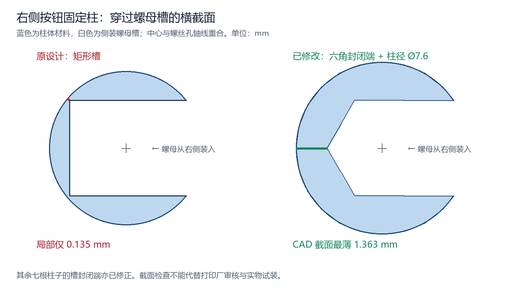

# 音乐控制器外壳 · 平整面板版

2026-09-27；长度单位均为 mm。桌面操作面前低后高，倾角 20°。这是待实物试装的可打印样件。

## 文件

打开 `../cad/Music_Controller.SLDASM` 查看整机。

打印 `../print` 中的四件：`Base_Smooth_20deg` 底壳、`Lid_Smooth_20deg` 上盖、`Encoder_Cradle` 编码器托架、`Button_Cradle` 按钮托架。不要打印 `REF_` 开头的电子器件参考件。

本目录只保留当前平整面板版。

## 此次修改

- 上盖外表面平整，只留编码器轴孔和按钮开口；四角凸台、正面安装螺丝孔取消。
- 四颗外壳螺丝改从底部旋入上盖内部柱子里的侧装螺母。
- 两个控制模块先固定在独立托架上，再从内部装到上盖盲孔柱。面板正面不穿螺丝。
- 编码器及原托架绕轴心旋转 90°，排针朝后；上盖内两根对应固定柱、螺丝孔、螺母槽随之移位。旋钮中心及按钮位置不变。
- 修复打印厂指出的螺母槽薄壁：八个槽改为六角封闭端，右侧按钮固定柱从 Ø6.8 加粗至 Ø7.6；轴孔、按钮开口、螺丝孔中心不变。
- 上盖使用中性灰默认外观。软件颜色不指定实际打印材料颜色。
- 载板及主控移至后部中间，USB-C 开口中心 X=50。USB-C、RUN、BOOT 所在面朝上，接口朝后。
- 主控用微雪官方 RP2350-Zero STEP 参考模型替换简单占位块。
- 根据打印厂薄壁反馈及外观要求，USB-C 改为圆角内凹结构：外槽 13 × 8、深 1.2，内孔 10.5 × 5；槽底厚 1.5，取代原 0.5 厚薄边。主后壁保持 2.5 厚。

## 外形与位置

| 项目 | 数值 |
|---|---:|
| 外壳宽 × 深 | 100 × 84 |
| 外轮廓圆角 | R6 |
| 前缘／后缘面板外表面高度 | 21.193／51.766 |
| 壁厚／底厚／面板法向厚度 | 2.5／2.5／3 |
| 按钮开口 | 13.3 × 13.3 |
| 编码器轴孔 | Ø8.2 |
| USB-C 包胶避让外槽（宽 × 高） | 13 × 8，R1.5，深 1.2 |
| USB-C 槽底内孔（宽 × 高） | 10.5 × 5，R1.5 |
| USB-C 槽底厚度 | 1.5 |
| USB-C 开口中心 | X=50，Z=22.29 |

USB-C 外槽按实测线头包胶 11.26 × 6.43 取整留余量为 13 × 8，四角 R1.5。它是圆角矩形，不是两端完整半圆，避免圆弧挤占包胶四角的空间。与外槽居中时，包胶左右每侧名义余量 0.87，上下每侧 0.785；按矩形包胶检查圆角处，最小余量约 0.55。考虑官方模型接口中心的竖向偏差后，最小角部余量约 0.26。

外槽范围 X=43.5..56.5、Z=18.29..26.29，槽底在 Y=82.8，距后壁外表面 Y=84 为 1.2。槽底小孔范围 X=44.75..55.25、Z=19.79..24.79，宽 10.5、高 5、R1.5。内侧增加 16 × 10、R2.5 的局部背衬，从 Y=81.3 延伸到后壁，槽底实体厚度为 82.8−81.3=1.5，高于本次工厂提出的 1 mm 要求；主后壁厚仍为 2.5。局部背衬距参考主控 PCB 后边约 0.29，装配检查未发现体积干涉。

线头金属露出长度为 6.9；用户另实测完全插到底后，包胶前沿距插座口为 1.8..2，本版采用较小的 1.8。参考插座最靠外端 Y≈82.065，槽底比插座口向外 0.735，所以插到底时包胶距槽底名义余量为 1.8−0.735≈1.065。这个计算采用实际插合后的距离，不把金属总长当作有效插合深度。

外槽允许包胶进入，小孔周围的槽底遮住大部分内部空间；接口周围仍留装配缝，不构成密封。仍需用该实测线材试插，确认打印公差、实际主控高度及包胶后段没有造成阻挡。[查看原生装配预览](USB_RECESS.png)。

上述 USB 修订更新底壳原生零件和 `../print/Base_Smooth_20deg.STL`。随后的编码器朝后修订另更新上盖原生零件、`../print/Lid_Smooth_20deg.STL` 和整机装配；底壳及两件托架没有因编码器转向而改变。打印时使用当前 `print` 文件夹中的四件，均已统一从当前原生 CAD 重新导出。随后螺母槽薄壁修订再次更新上盖几何，其余三件几何不变。

世界坐标：X 向右、Y 向后、Z 向上。载板参考范围 X=34..66、Y=46..81，底面 Z=7；固定孔中心为 `(37,49)`、`(63,49)`、`(37,78)`、`(63,78)`。后壁 Y=84。

面板局部坐标 U 向右、V 沿斜面向后、W 垂直面板向外，外表面 W=0。旋钮中心 `(31,37)`，按钮中心 `(77,37)`。旋钮帽顶面 W=19.90，未按下按钮顶面 W=5.30。编码器 PCB 底面 W=-14.07，按钮 PCB 底面 W=-9.70。

托架的外侧安装孔 Ø3.4 配 M2 螺丝，理论径向可调约 0.7。实际调整范围还受按钮开口、轴孔、托架边缘、垫片和线束限制；应先居中、试按，再锁紧。模块自身原安装孔使用 M2，位置误差由整个托架调节，不靠扩大模块 PCB 孔解决。

## 螺丝与装配

### 编码器出线复核（2026-09-27）

编码器已绕轴心转 90°，排针朝后，原接头仍可保留。旋钮中心 `(U,V)=(31,37)` 不动，编码器托架本体不改形状，只改变装配方向。上盖内部两根对应固定柱、盲螺丝孔和侧装螺母槽已移位；螺丝规格不变。**此次需要替换打印文件的是 `Lid_Smooth_20deg.STL`。现有编码器托架可继续使用；旧上盖的固定柱位置不适配新方向。**

用户补测裸针长 6.69，此前测得插合后排针侧 PCB 板边到接头及导线弯折外端共 15.62。最新总长约 48.5 沿用包含接头及弯折的口径，减去 PCB 长 32.30，板边外占位采用约 16.2，不再重复加裸针长度。设计先额外留 5，再把板边外预留取整为 **22**，即整套检查长度 **54.3**，比实测总长多约 **5.8**。这是布局余量，不是线材规格规定的最小弯曲半径。

原朝右方案在接头高度处到按钮托架仅约 13.45，小于上述约 16.2 的占位，因此改为朝后。

| 项目（面板局部坐标，mm） | 当前范围／位置 |
|---|---|
| 编码器 PCB | U=22.54..39.46，V=24.725..57.025 |
| 编码器 PCB 底面 | W=-14.07 |
| 排针方向 | +V，沿面板向后 |
| 托架右侧固定柱中心 | U=44.5，V=29 |
| 托架左侧固定柱中心 | U=17.5，V=53 |
| 接头与弯线检查范围 | U=22.54..39.46，V=57.025..79.025，W=-12.29..-6.29 |

检查范围的截面暂按 **16.92 宽 × 6 高**，从编码器 PCB 上表面起算，覆盖 PCB 全宽；这个截面是设计假设，实际包胶高度及弯线横向形状尚未完整测量。用当前原生装配导出的各零件表面与该范围逐三角形检查，没有相交。该范围距主后壁最小约 **3.04**，距上盖内面 **3.29**；其最低点比官方主控参考模型最高点高约 **5.63**。预留区不要再塞入别的线束，接头后的导线自然弯向载板，避免合盖时被拉紧或夹住。

整机现有实体体积干涉检查为 0。上述线束空间检查与实体检查分别进行，不把未建模的真实导线等同于已验证的实体。试装时保持接头和弯线在预留区内；若实际接头高于 6 或导线超出范围，应先复核再合盖，不能靠压线获得空间。

[当前内部布局预览](ENCODER_REAR_LAYOUT.png)：图中为简化参考模块，没有绘出实际排针和弯线；编码器长板的后端为排针侧，上盖、旋钮帽和按钮帽暂时隐藏以显示内部。

### 上盖螺母槽薄壁修正（2026-09-27）

工厂标出的 0.13 mm 来自槽角到柱外壁的距离：旧右侧按钮柱半径 3.4，矩形槽封闭端距柱心 2.5、槽半宽 2.1，因此最薄处为 `3.4−√(2.5²+2.1²)≈0.135`。柱子不是整体掏空，但螺丝孔与侧装螺母槽周围必须保留足够材料。此前实体干涉和 STL 网格检查不能发现或证明这项壁厚要求。

现将八个矩形槽的封闭端改成六角形的两条斜边，匹配普通六角螺母，保留从侧面插入的通道。M2 槽对边 4.2、高 1.8，M3 槽对边 5.8、高 2.8；右侧按钮柱加粗到 Ø7.6，其余柱径不变。原矩形切除特征已压缩，末尾新增命名的六角槽草图与切除特征，仍可直接编辑。普通六角螺母的一对平行边对准槽两侧，尖角朝封闭端；不要按此槽采购方螺母、法兰螺母或热熔嵌件。

| 检查部位 | CAD 理论壁厚 | 导出 STL 截面最小壁厚 |
|---|---:|---:|
| 四角 M3 柱的槽封闭端 | 1.651 | 1.645 |
| 两根编码器柱及左侧按钮柱的槽封闭端 | 1.575 | 1.569 |
| 右侧按钮柱的槽封闭端 | 1.375 | 1.370 |

以上数值是槽中间高度处，从六角封闭端两条斜边到柱外圆轮廓的最短距离，不把有意敞开的装入槽口视作封闭壁，也不等同于全模型壁厚认证。加粗后的按钮柱距底壳右内壁名义净距 0.4；原生装配实体干涉为零。M2/M3 螺丝孔、螺母槽高度位置和原有螺丝长度保持不变。新上盖 STL 应重新上传让工厂审核，再做实物装配验证。

### 螺丝清单

| 位置 | 规格 | 数量 |
|---|---|---:|
| 外壳底部四角 | M3×10 螺丝，头径不超过 6.6 | 4 |
| 上盖内部四角 | M3 六角螺母，常见对边 5.5；槽宽 5.8、高 2.8 | 4 |
| 托架固定到盖内柱 | M2×8 螺丝、薄平垫片（外径约 5） | 各 4 |
| 托架固定到盖内柱 | M2 六角螺母，常见对边 4；槽宽 4.2、高 1.8 | 4 |
| 模块 PCB 固定到托架 | M2×8 螺丝、M2 螺母 | 各 4 |
| 模块 PCB 固定到托架 | 薄垫片，编码器侧外径不超过 4.5 | 适量 |
| 载板固定到底壳 | M2×10 螺丝、M2 螺母，板面紧固件外径不超过 4.5 | 各 4 |
| 底面防滑与螺丝头避让 | 约 2 厚自粘脚垫 | 4 |

1. 将四颗 M3 螺母从上盖内部长柱侧面的槽插入；将四颗 M2 螺母装入控制模块安装柱侧槽。
2. 把按钮 PCB 和编码器 PCB 分别固定到托架；编码器排针朝后，与旋钮轴同侧的两个 PCB 安装孔朝前。托架开放中间避让背面电子器件；试装确认器件、插座、焊点没有压在支承边上。
3. 把托架从内部装到上盖。M2×8 螺丝由托架底面向上旋入柱内螺母，先保持略松。校正按钮与轴在开口中的位置，试按确认不擦边，再适度拧紧。
4. 载板安装到四个短柱，主控通过排针插入排母。USB-C、RUN、BOOT 朝上，USB 指向后壁居中开口。
5. 线束留活动余量，先用实际 USB 线试插，确认插入充分且不挤压主控，再合盖。
6. 四颗 M3×10 从底部穿入上盖盲孔柱，分次均匀锁紧，贴脚垫。

控制模块的固定螺丝已从旧版 M2×16 改为 M2×8。外壳四角采用 M3×10，是按底部新固定结构选取，不能仅为了短而任意换成接触不到螺母的长度。试装以实际螺丝头、垫片、螺母尺寸确认啮合和盲孔余量。

## 打印和检查边界

四个 STL 应以 mm、100% 比例导入切片。底壳和托架平底朝下；上盖外表面朝下，平面直接贴床，内部柱朝上。侧装螺母槽、USB 窗口顶边是否加局部支撑，依打印机桥接能力决定。不要让支撑堵死螺母槽。

按钮实测宽 12.11，开口每侧名义余量约 0.595；轴套实测直径 6.81，轴孔径向余量约 0.695。这些余量是为了装配和测量误差保留，不代表已验证打印机精度。

主控官方模型来源：https://www.waveshare.com/wiki/RP2350-Zero ，下载文件名为 `RP2350_Zero_step.zip`，现已转换为 `../cad/REF_RP2350_Official.SLDPRT` 独立零件。官方模型接口宽约 8.94；官方 CAD 的板厚、接口高度与用户实测略有差别，本版接口开口高度仍兼顾用户实测接口高出 PCB 上表面 3.28。主控正面 PCB 表面定位 Z=20.65，实际排针插合高度还需试装核对。不能将官方模型每一处几何都视为实物绝对尺寸。

编码器、按钮和线束仍为简化参考；现有实体检查不包含模块全部小元件和焊锡；编码器接头及弯线另按上文的预留范围检查，不能代替真实线束试装。当前样件未经过实际打印、按压或插拔试验。先试装上盖和两托架，再确认整机。

检查记录见 `VERIFICATION.txt`。原生特征保留为草图、拉伸和切除，后续可直接学习修改，无需运行宏即可打开模型。

## 本版数字检查结果

当前上盖为单一实体，特征检查无错误；编码器朝后装配保存、关闭、重新打开和重建成功，十个组件引用均位于本 CAD 文件夹，现有实体体积干涉为零。四个打印零件在螺母槽修正后统一重建并按 mm 重新导出，均为单实体、无特征错误；全部 STL 的闭合、单壳体、边方向、法向及自交检查通过。上盖调整为外面板朝下的打印方向，不缩放。整机透视状态已保留并保存；保存和导出均为 0 错误、0 警告。八处槽封闭端另做 CAD 表面与导出 STL 截面检查，结果见上文。接头及弯线另按上述假设截面复核通过；尚未做实物打印和试装。
